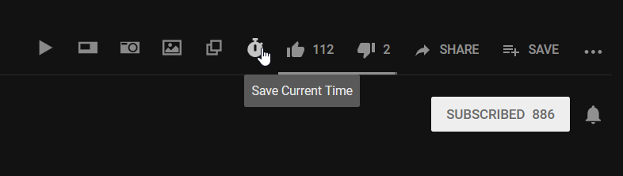

# Iridium++
> melhorias ao UserScript [iridium](https://github.com/ParticleCore/Iridium) (da versão `0.2.5`)

- Adiciona a funcionalidade de salvar o tempo, assim, o vídeo será recarregado com a URL alterada para manter o tempo corrente do ponteiro

- "Corrige" a função de _autoplay_ que, às vezes, não funciona corretamente. Então força o pause do vídeo, se o _autoplay_ estiver desativado
