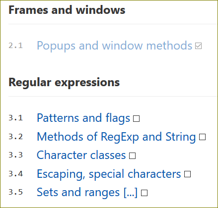
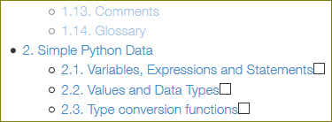
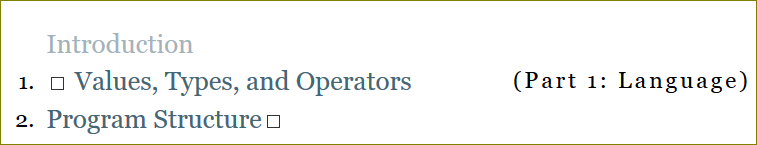

# Registrar Caminho

## demos

## uso

Basta adicionar uma propriedade na varíavel `itemsSelectors`, onde a chave é o domínio do site incluído (`@include`) e o valor é um array de 2 valores, sendo o segundo opcional. O primeiro é o **seletor CSS** que selecionará todos os elementos que receberão o _checkbox_. O segundo elemento é uma função que recebe um nó (selecionado pelo seletor) e retorna o elemento que deverá ser alvo do `.scrollIntoView()` caso esse nó seja o último "marcado" (_checkbox_ checada).
Assim, o _scroll_ da página será ajustado automaticamente.
