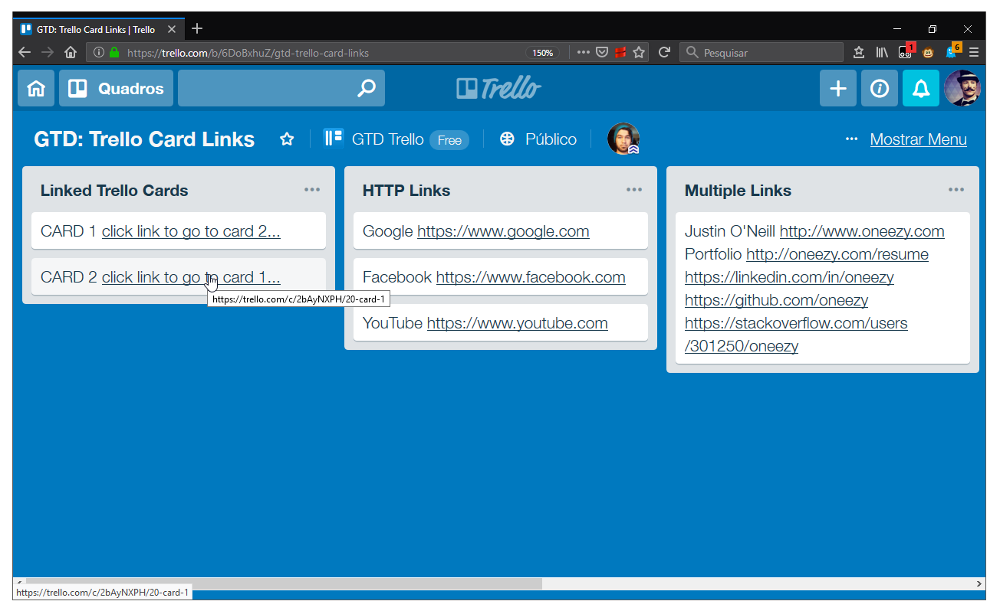
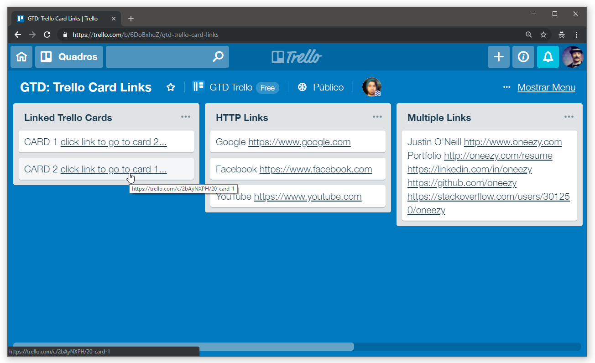
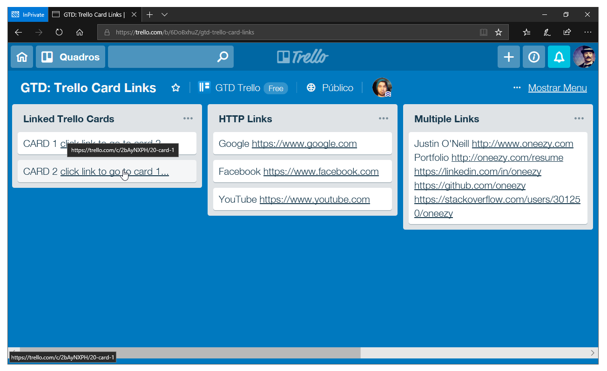

# Trello Cards Hyperlinks

## Features
- Clickable links on cards titles
- Multiple links on cards titles
- Lightweight & Quick update

## Install
- Just click on source [`Trello_Cards_Hyperlinks.user.js`](./Trello_Cards_Hyperlinks.user.js) and press `raw` or
- [Greasy Fork](https://greasyfork.org/en/scripts/376569-trello-cards-hyperlinks) or
- [OpenUserJS.org](https://openuserjs.org/scripts/micalevisk/Trello_Cards_Hyperlinks)

## [Demo](https://trello.com/b/6DoBxhuZ/gtd-trello-card-links)
> <small>thanks to [oneezy](https://github.com/oneezy/gtd-trello-card-links)</small>

#### Firefox

#### Chrome

#### Microsoft Edge

